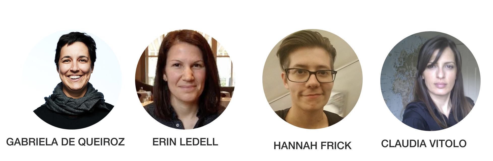
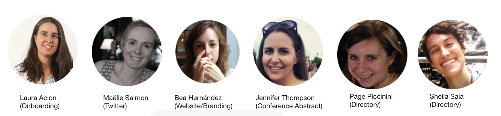
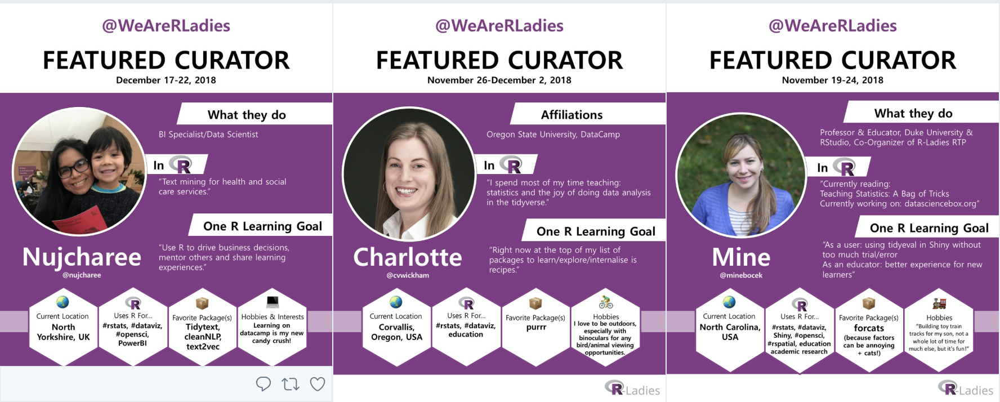
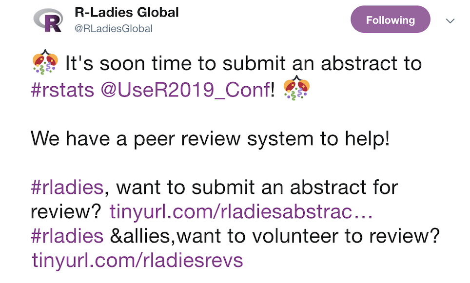
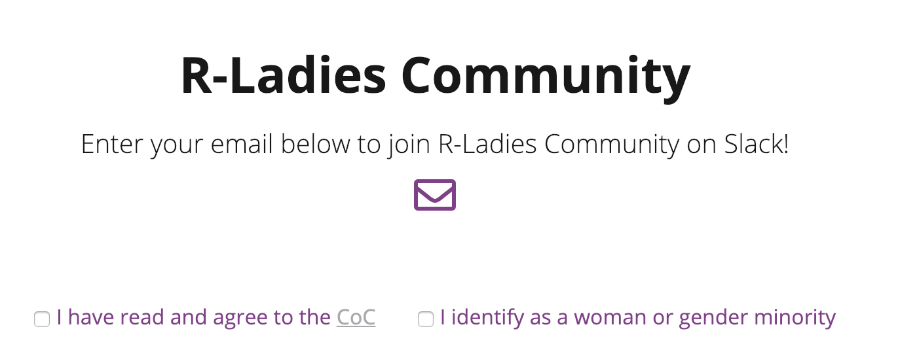
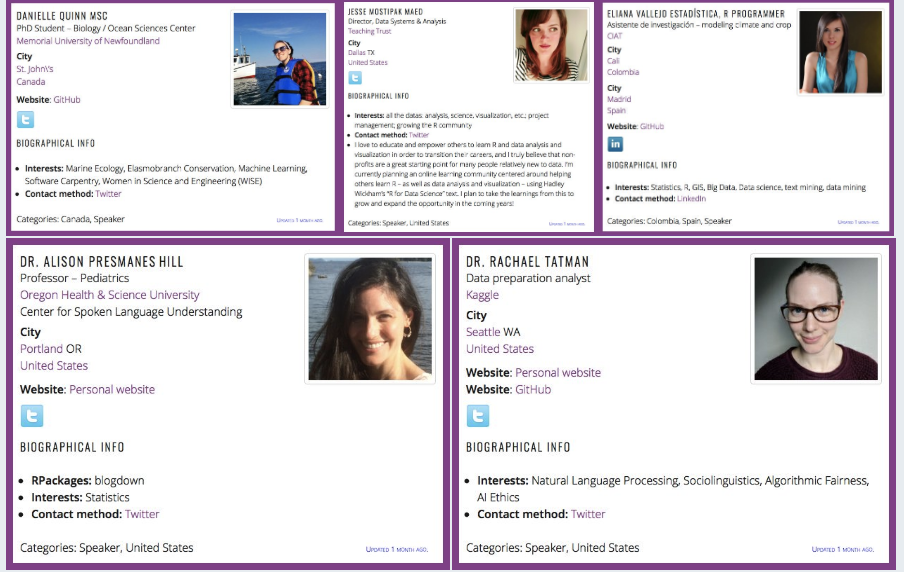
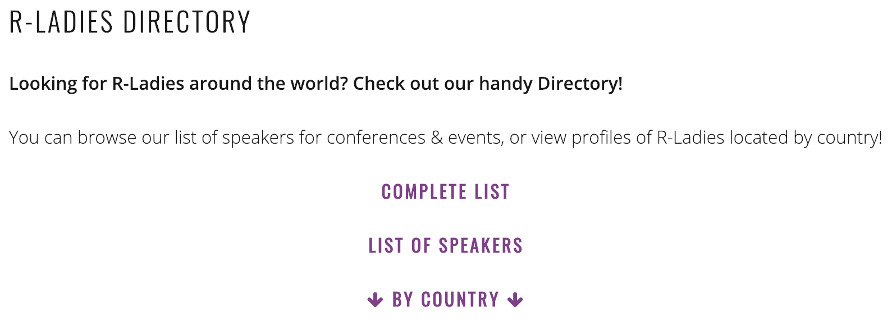
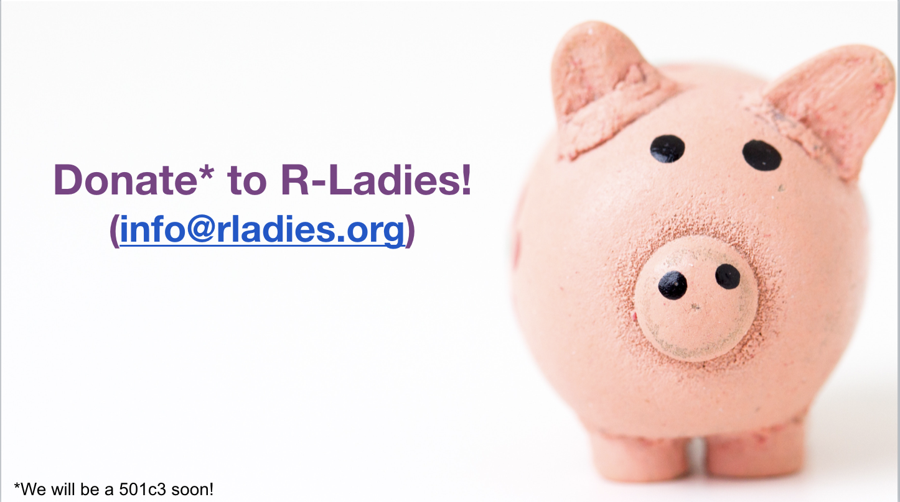

                    

## Header row {data-height=5}

###

<table style="width:100%">
<tr>
  <td>
<h3>
  **A tour inside the R-Ladies organization**
  </h3>
</td>
  <td rowspan="2">
  </img>
  </td>
</tr>
<tr><td>

<a title="R-Ladies email" href="mailto:info@rladies.org" target="_top">
  **R-Ladies Global (www.rladies.org)**
  </a>
</td>
</tr>
</table> 

<!-- 
 -->

## Body row {data-height=80}

### **What is R-Ladies?**

R-Ladies is an organization with the mission of promoting diversity in the R Community via meetups and mentorships in a safe and friendly environment.

**R-Ladies Leadership Team (current):** 
</img>

**R-Ladies Global Team:** 
</img>  

****

**R-Ladies Groups Around the World**

We have 137 chapters in 44 countries:

- 49 in the US & Canada
- 29 in Latin America
- 40 in Europe
- 5 in Africa
- 6 in Asia
- 7 in Australia/Oceania
</img>

Are you interested in starting a chapter? Send us an email: info@rladies.org

### **R-Ladies Initiatives**

<a href="https://twitter.com/WeAreRLadies">**@WeAreRLadies**</a> - Team: Katherine Simeon + other volunteers
  </img>
  
The R-Ladies RoCur (Rotating Curation) is a twitter handle that will feature an awesome R-Lady each week. 
This account is run by R-Ladies Global.
  
<!-- </img> -->

****

<a href="https://docs.google.com/forms/d/e/1FAIpQLSck8FBjNWjziI8pPIoCBlf5J4oQ_6pzeUdbQ1HjYfJ2bNDwDw/viewform">**R-Ladies Abstract/Scholarship Review Request**</a> - Team: Jennifer Thompson + other volunteers  
  </img>

Feedback on various types of R-related abstracts, applications and diversity scholarships to encourage R-Ladies to apply for conference speaking slots and opportunites. 

****

<a href="https://github.com/rladies/rladies-collaborations">**R-Ladies Collaborations**</a> - Team: Melina Vidoni, Sina Rüeger + other volunteers  

Capture R-Ladies collaborations in a single portfolio. R-Ladies around the world often work with organizations, ONGs, and other groups, producing contributions, participation, involvement or associations of talks, workshops, projects, conference, etc. And they directly impact the R community.

### **R-Ladies Initiatives**

<a href="http://rladies-community-slack.herokuapp.com">**R-Ladies Community Slack** </a> - Team: Florencia D'Andrea, Melina Vidoni, Sina Rüeger, Yanina Bellini + other volunteers
  </img>  

R-Ladies community Slack is a safe & global space to discuss topics and share ideas around #rstats & the #rladies community (for women and gender minorities).

****

<a href="https://twitter.com/rladies_iwd2018">**R-Ladies Internation Women Day (@rladies_iwd2018)**</a> - Team: Maëlle Salmon, Bea Hernández, Kelly O’Briant, Page Piccinini, Sheila Saia + other volunteers  
  </img>
  
Internation Women Day celebrating with a fabulous feed of featured profiles from the R-Ladies directory.

### **R-Ladies Initiatives**

<a href="https://www.meetup.com/rladies-remote/">**R-Ladies Remote**</a> - Team: Auriel Fournier, Abigail Lebrecht, Steph De Silva + other volunteers  

- Coffee Chat

Informal and casual group chat about R, working remote, R-Ladies or anything that you'd like to be discussed.

- Reading Group

Reading and Discussion about a paper or article.

****
<a href="https://rladies.org/directory/">**R-Ladies Directory**</a> - Team: Page Piccinini, Sheila Saia  
</img>

List of profiles from R-Ladies around the world, located by country. 

****
****

#### **What is next?**

R-Ladies will be a 501c3 soon. 
</img>

<b>If you want to sponsor, donate or support us, send us an email to: info@rladies.org</b>

<!-- ## Footer row {data-height=10}  -->

<!-- ### {data-width=50} -->

<!-- ### {data-width=50 .small} -->

